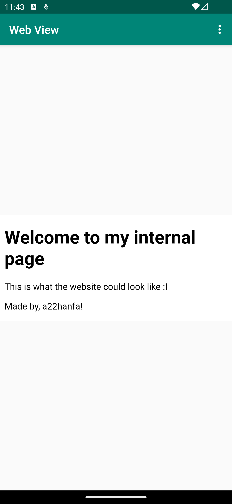

# Rapport

In this session, we have discussed the process of creating an Android app that displays a WebView, allowing users to view an internal HTML page (stored as an asset) and an external web page. Here's a brief summary with corresponding code snippets and explanations.

By adding this line of code to the AndroidManifest.xml are we enabling internet access through the app
``
<uses-permission android:name="android.permission.INTERNET" />
``

To create the WebView element I replaced TextView in activity_main.xml
``
<WebView
android:id="@+id/my_webview"
android:layout_width="wrap_content"
android:layout_height="wrap_content"
app:layout_constraintBottom_toBottomOf="parent"
app:layout_constraintEnd_toEndOf="parent"
app:layout_constraintStart_toStartOf="parent"
app:layout_constraintTop_toBottomOf="@+id/appBarLayout"
/>
``

In the MainActivity.java file the WebView was configured. By creating a WebViewClient and enabling javaScript.
```
// Reference the WebView element
myWebView = findViewById(R.id.my_webview);

// Set a custom WebViewClient
myWebView.setWebViewClient(new MyWebViewClient());

// Enable JavaScript execution
WebSettings webSettings = myWebView.getSettings();
webSettings.setJavaScriptEnabled(true);

```

To get the websites to load loadUrl() method was used. 
```
private void showExternalWebPage() {
    myWebView.loadUrl("https://www.his.se");
}

private void showInternalWebPage() {
    myWebView.loadUrl("file:///android_asset/internal_page.html");
}

```

Call methods on menu item click:
```
if (id == R.id.action_external_web) {
    Log.d("==>","Displays external web page");
    showExternalWebPage();
    return true;
}

if (id == R.id.action_internal_web) {
    Log.d("==>","Displays internal web page");
    showInternalWebPage();
    return true;
}
```
Here is the final result:
 